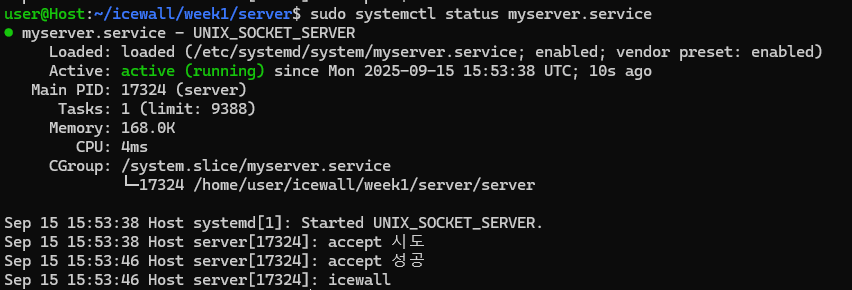

- 클라이언트


- 서버

### 응답방식
- server -> client(console.log("icewall")) -> server ("icewall")

### daemon 세팅

1. myserver.service
```
[Unit]
Description=UNIX_SOCKET_SERVER
After=network.target
ExecStartPre=/usr/bin/rm -f /tmp/sock

[Service]
ExecStart=/home/user/icewall/week1/server/server
Restart=always
RestartSec=5
User=user
WorkingDirectory=/home/user/icewall/week1/server

[Install]
WantedBy=multi-user.target
```

2. 세팅 명령어

```
sudo systemctl daemon-reload
sudo systemctl restart myserver.service
sudo systemctl status myserver.service #확인용
```

